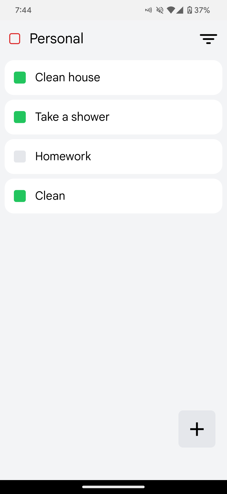
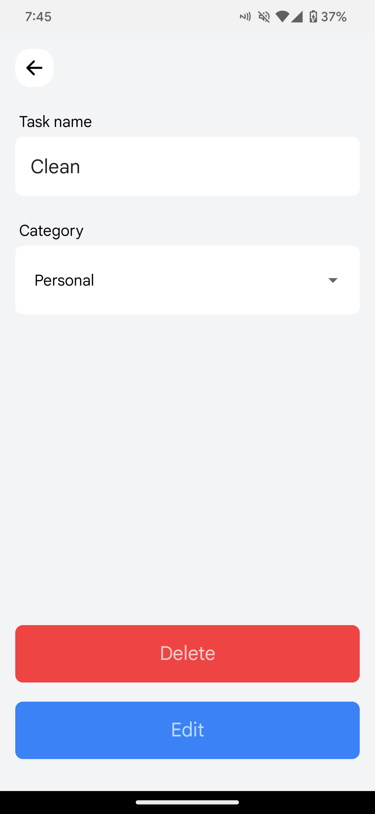
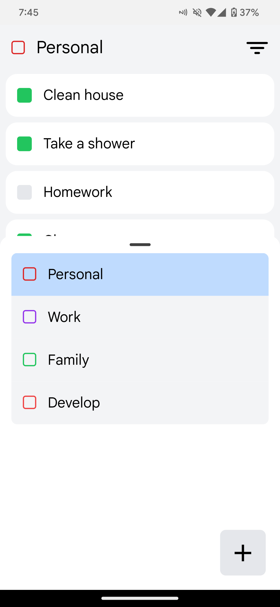
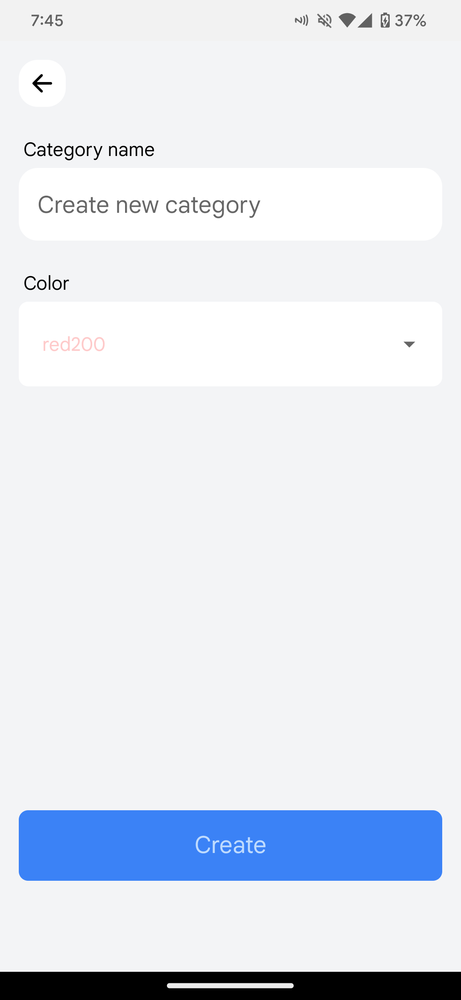
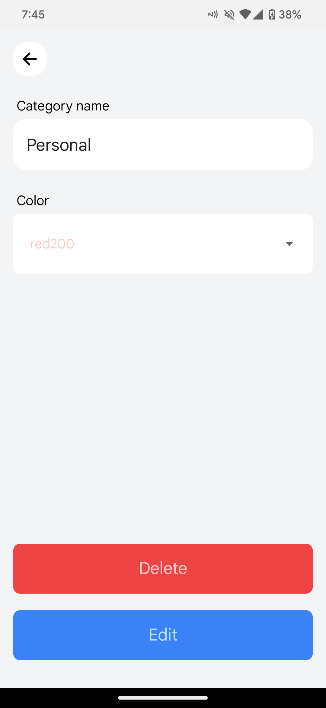
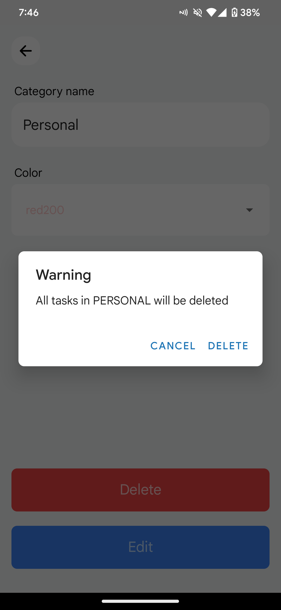

# Todo react native

This project is a CRUD (Create, Read, Update, Delete) application designed to help you manage your daily tasks, organized by categories.

It is built using React Native, and all data is saved locally on your device.

<table>
  <tr>
    <td>
      
    </td>
    <td>
      
    </td>
  </tr>
  <tr>
    <td>
      
    </td>
    <td>
      
    </td>
  </tr>
  <tr>
    <td>
      
    </td>
    <td>
      
    </td>
  </tr>
</table>